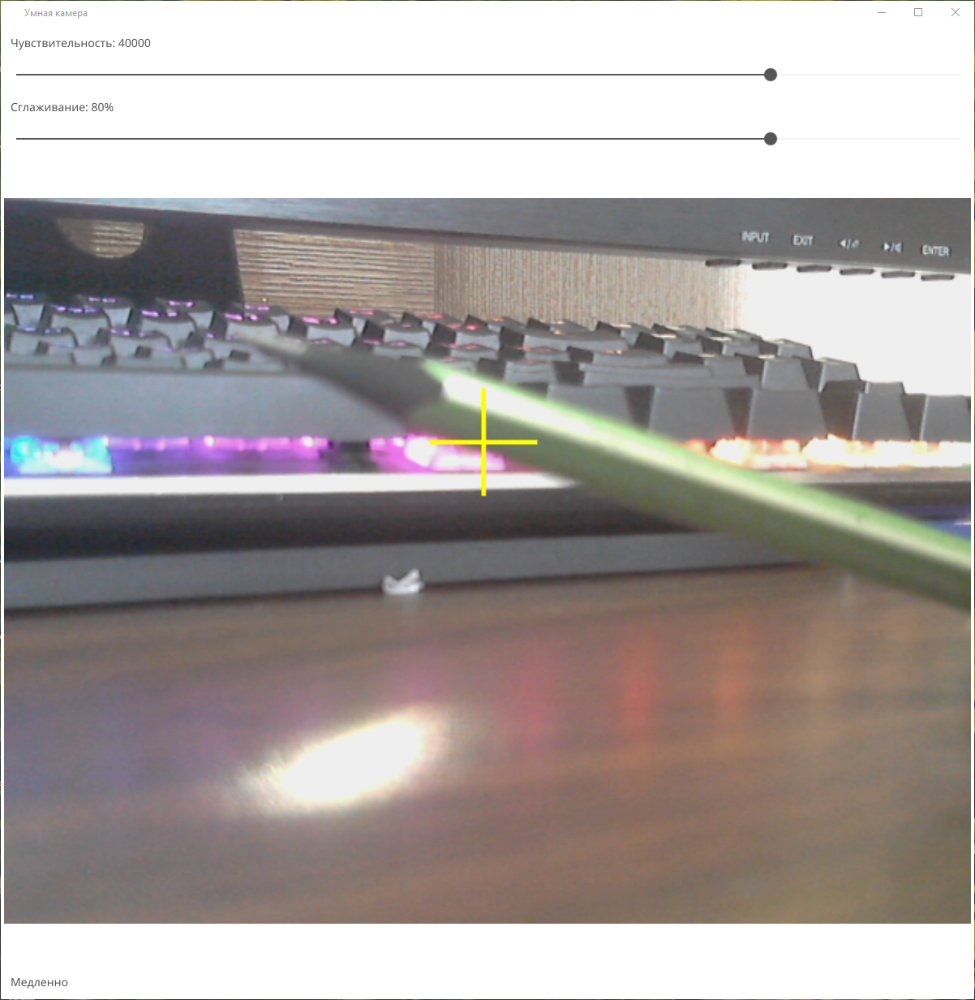

# Камера детектор движения на Go
Детектор движения на Go. Может:
* Обнаружать движущиеся объекты;
* Приблизительно оценивать их скорость.

Может быть настроена чувствительность, а также сглаживание курсора.

## Демонстрация работы



## Сборка у себя
Для сборки необходим Go, а также MinGW 64 для создания описания в файле, а также добавления иконки.
```
make syso
make build
```